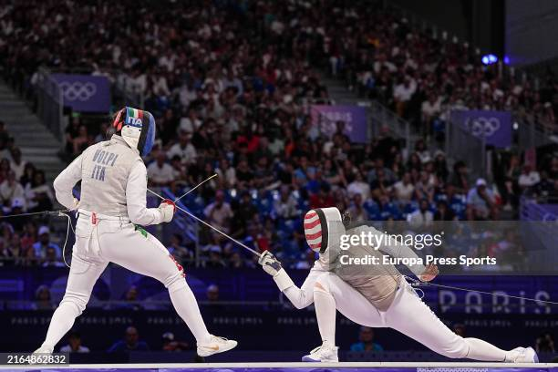
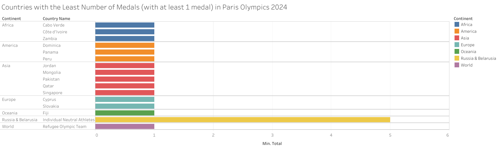
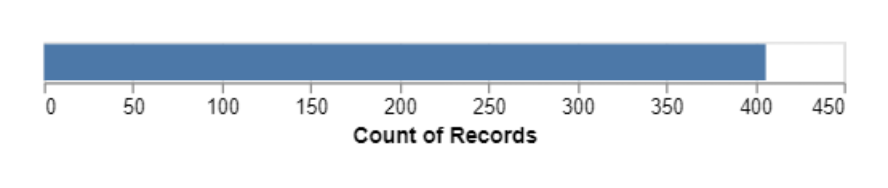

# HW 1 - CS 625, Spring 2025

Name: Bhargav Iyer
Due:  January 26, 2025

## Git, GitHub

*What is the URL of the GitHub repo that you created in your personal account?*\
https://github.com/odu-cs625-datavis/Spring25-asv-biyer108
 
*What is pull vs clone in GitHub?*\
git clone is downloading the entire repository including all branches, history, and files.  While git pull copies changes from the remote repository and merges it 
with your local branch.
 
*You have committed a change on your local machine/remote. However, you want to undo the changes committed. How would you do that?*\
git revert will undo the changes committed.
 
## Markdown

*Create a bulleted list with at least 3 items*
 - Epee
 - Sabre
 - Foil

*Write a single paragraph that demonstrates the use of italics, bold, bold italics, code, and includes a link. The paragraph must explain your favorite Olympic sport/game, the country that won the most number of olympic GOLD medals (Summer) in your favorite sport in 2020 (Japan) and 2024 (France). You are free to include more information.*\
My favorite Olympic sport is **Fencing**.  Fencing is the sport of weilding *swords* such as an ***Epee***, ***Sabre***, and ***Foil***.  The country that has won the most gold medals in Fencing in 2020 (Japan) was [Russia](https://www.olympics.com/en/olympic-games/tokyo-2020/results/fencing).  The country that has won the most gold medals in Fencing in 2024 (Paris) was [Japan](https://www.olympics.com/en/paris-2024/sports/fencing).

```python
Gold   = 3
Silver = 4
Bronze = 1
print("This is the number of Gold gotten: ", Gold)
print("This is the number of Silver gotten: ", Silver)
print("This is the number of Bronze gotten: ", Bronze)
```

*Create a level 3 heading*
### Image of Olympic Sport ###

*Insert a image of your favorite Olympics sport/game, sized appropriately*


## Tableau

*Insert the image of your horizontal bar chart here. Reminder, this should show countries that won the least number of medals only (excluding ZERO) in Paris2024 Summer Olynpics by continent (one country from each continent is ok).*


## Google Colab

*What is the URL of your Google Colab notebook?*\
https://colab.research.google.com/drive/1rLOcpyoTkNuYsBbhTA5qlLtfcfqytzoL

## Python/Seaborn

*Insert the first penguin chart here*\


*Describe what the figure is showing.*\
This figure shows a penguin's bill length vs. a penguin's bill depth.  This figure seems to have 3 or 4 clusters which might indicate different species potentially on different islands.

*Insert the second penguin chart here*\


*Describe what the figure is showing.*\
This figure shows the body mass of the different penguin species differentiated based on gender.  All the female penguins body mass is less than their male counterparts.  Also the body mass of the largest to smallest is Gentoo Species, Chinstrap, and Adelie.

*What happened when you removed the outer parentheses from the code? Why?*\
The code did not work.  This is because the statement is split into two with .add in the next line.  The parentheses make the function work as one statement.  If you remove the parentheses and make the two lines into one continuous line, the function will work as usual.

## Observable and Vega-Lite

*What happens when you replace `markCircle()` with `markSquare()`?*\
It changed the points from circles to squares on the plot Miles per gallon vs Horsepower.

*What happens when you replace `markCircle()` with `markPoint()`?*\
It changed the points from circles to circles that are not filled in (essentially points).

*What change do you need to make to swap the x and y axes on the scatterplot?*\
Just switch the names.  Like this:\
vl.x().fieldQ("Miles_per_Gallon"),\
vl.y().fieldQ("Horsepower"),

*Insert the bar chart image here*\



*Why do you think this chart is the result of this code change?*\
This shows the number of car models of all the countries together and not seperated by each country (Europe, Japan, and U.S.).  The change occurred because of how removing .fieldN("Origin") removed the column aspect of categorizing based on Origin.

## References

*Every report must list the references (including the URL) that you consulted while completing the assignment. Replace the items below with the references you consulted*

* Reference 1, <https://www.olympics.com/en/olympic-games/tokyo-2020/results/fencing>
* Reference 2, <https://www.olympics.com/en/paris-2024/sports/fencing>
* Reference 3, <https://observablehq.com/@observablehq/vega-lite>
